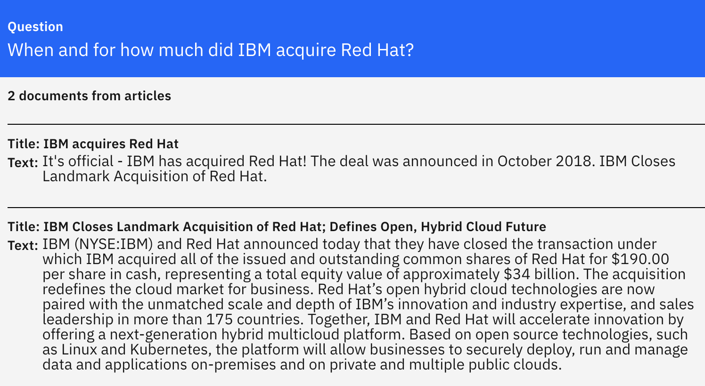

# Question Answering Service based on IBM Software

This repo contains a simple implementation of a `Question Answering` microservice which supports generative conversational search scenarios by leveraging `Foundation Models`, IBM software and open source.

At this point three steps are taken to generate answers:

1. Full text searches
2. Reranking
3. Answer generation

Two large `Large Language Models` are used:

1. ReRanker which is typically an encoder-based transformer
2. Answer generator which is typically a decoder-based transformer

Involved technologies:

* IBM Watson Discovery
* ColBERT Reranker DrDecr in PrimeQA (e.g. hosted on IBM Cloud)
* Large Language Model hosted via some MaaS (Model as a Service) provider
* Optional: IBM Watson Assistant
* Optional: IBM Code Engine

There are two main components:

1. Question answering microservice which orchestrates the pipeline above
2. Experiment runner to evaluate options based on ground truth documents


## Sample Scenario

Sample documents have been uploaded to Watson Discovery. After searching and reranking the results are passed as input via a prompt executed with a large language model.

The answer to the question "When and for how much did IBM acquire Red Hat?" is generated from two different documents.

<kbd></kbd>

<kbd></kbd>


## Getting started

To get started as easily as possible containers are provided. Additionally Watson Discovery and the PrimeQA ReRanker need to be provisioned and configured.

The microservice, the experiment runner and a mock MaaS (model as a service) service can be run locally via Docker including Docker Compose. Furthermore a sample dataset is provided and a sample ground truth document.

There are five steps to run your first experiment against the ground truth file which invokes the question answering service and all necessary AI functionality:

1. Clone the repo
2. Provision Watson Discovery, upload data and point to it from your local environment
3. Set up the PrimeQA ReRanker in a VM and point to it from your local environment
4. Start three local containers
5. Configure your experiment and run it

See the [Getting Started](Setup.md#getting-started) instructions for details.


## API

There are several endpoints to test and compare results. Main flows:

1. /query: Reads documents from Discovery, reranks results and uses MaaS to return answer
2. /query-discovery-maas: Returns answer from Discovery and MaaS
3. /query-primeqa-maas: Returns answer from PrimeQA (connected to Discovery) and MaaS

Further [endpoints](https://github.com/nheidloff/question-answering/blob/main/service/src/main/java/com/ibm/question_answering/AnswerResource.java) can be used for testing.

An OpenAPI doc is provided via http://localhost:8080/q/swagger-ui/ and http://localhost:8080/q/openapi.

<kbd></kbd>

The Question Answering service has (almost) the same interface as the query endpoint of [Watson Discovery](https://cloud.ibm.com/apidocs/discovery-data#query) except of one addition:

Rather than returning 'untrained' the document retrieval strategy is 'llm'. The title and the document_id of the first result is 'Answer'. matching_results is the amount of found documents in addition to the first result which is the answer. So there is one more result than found documents.

```
{
  "matching_results": 2,
  "retrievalDetails": {
    "document_retrieval_strategy": "llm"
  },
  "results": [
    {
      "document_id": "Answer",
      "title": "Answer",
      "text": [
        "IBM has acquired Red Hat for $34 billion in October 2018."
      ],
      "link": null,
      "document_passages": null
    }
```


**Sample REST API Invocations**

```
cd service
source .env
QUERY="xxx"
curl -X POST \
    -u "apikey:$QA_API_KEY" \
    --header "Content-Type: application/json" \
    --data "{\"query\": \"text:$QUERY\"}" \
    "http://localhost:8080/query-mock-confident" \
    | jq '.'

{
  "matching_results": 2,
  "retrievalDetails": {
    "document_retrieval_strategy": "llm"
  },
  "results": [
    {
      "document_id": "472ec509-9861-45aa-8bce-983289032484",
      "title": "Answer",
      "text": [
        "IBM has acquired Red Hat for $34 billion in October 2018."
      ],
      "link": null
    },
    {
      "document_id": "086988c4-ab65-44f6-a2b5-5bfdd8afdb44",
      "title": "IBM acquires Red Hat",
      "text": [
        "It's official ... Red Hat."
      ],
      "link": "https://www.ibm.com/support/pages/ibm-acquires-red-hat"
    },
    {
      "document_id": "fdc7a154-497b-4115-bb71-b3d20fe0c822",
      "title": "IBM Closes Landmark Acquisition of Red Hat; Defines Open, Hybrid Cloud Future",
      "text": [
        "IBM (NYSE:IBM) and Red Hat announced ... clouds."
      ],
      "link": "https://www.redhat.com/en/about/press-releases/ibm-closes-landmark-acquisition-red-hat-34-billion-defines-open-hybrid-cloud-future"
      ]
    }
  ]
}
```


## Watson Assistant

Sample how the API of this service can be integrated in Watson Assistant:

<kbd></kbd>


## Resources

* [Generative AI for Question Answering Scenarios](https://heidloff.net/article/question-answering-transformers/)
* [Generative AI Sample Code for Question Answering](https://heidloff.net/article/sample-question-answering/)
* [Introduction to Neural Information Retrieval](https://heidloff.net/article/introduction-neural-information-retrieval/)
* [Optimizing Generative AI for Question Answering](https://heidloff.net/article/optimizing-generative-ai-for-question-answering/)
* [Integrating generative AI in Watson Assistant](https://heidloff.net/article/integrating-generative-ai-in-watson-assistant/)
* [Setup of Bring Your Own Search in Watson Assistant](https://github.com/nheidloff/question-answering/tree/main/assistant)
* [Using PrimeQA For NLP Question Answering](https://www.deleeuw.me.uk/posts/Using-PrimeQA-For-NLP-Question-Answering/)
* [Finding concise answers to questions in enterprise documents](https://medium.com/ibm-data-ai/finding-concise-answers-to-questions-in-enterprise-documents-53a865898dbd)
* [Bring your own search to IBM Watson Assistant](https://medium.com/ibm-watson/bring-your-own-search-to-ibm-watson-assistant-587e77410c98)