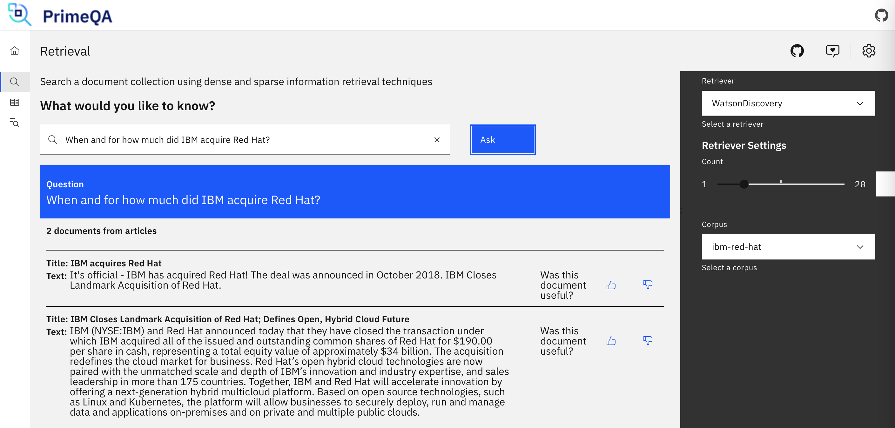
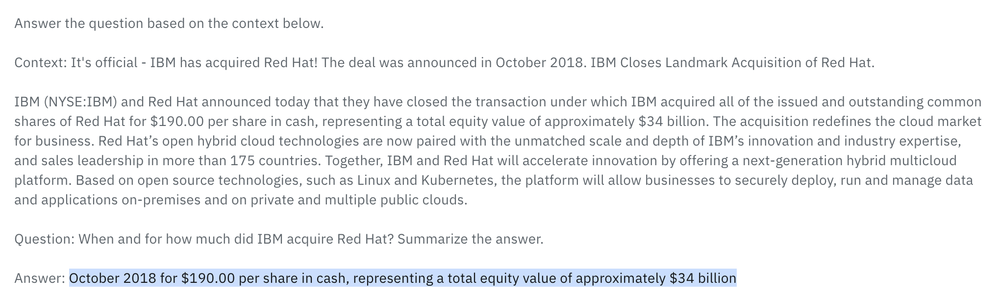
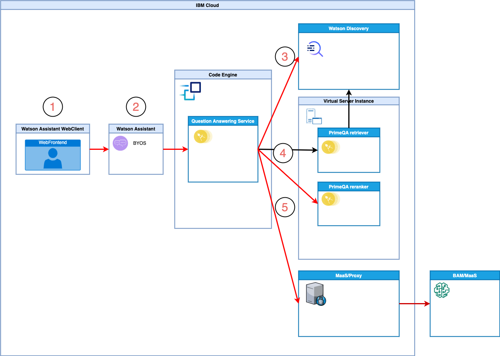
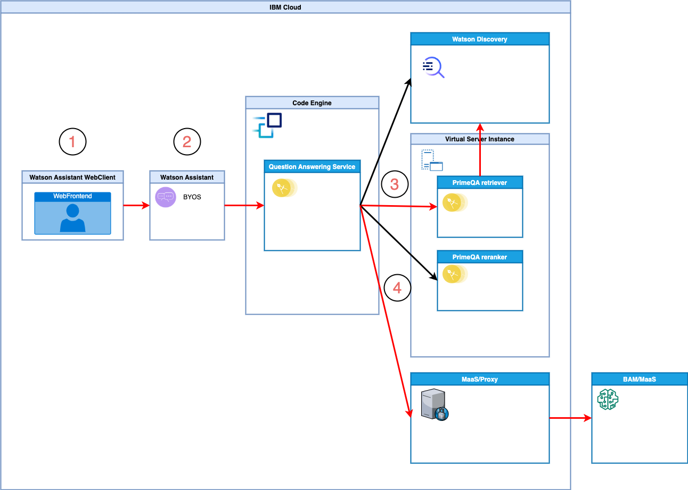

# Question Answering Service based on IBM Software

This repo contains a simple implementation of a `Question Answering` microservice which supports generative conversational search scenarios by leveraging `Foundation Models`, IBM software and open source.

At this point three steps are taken to generate answers:

1. Full text searches
2. Re-ranking
3. Answer generation

Two large `Large Language Models´ are used:

1. Re-ranker which is typically an encoder-based transformer
2. Answer generator which is typically a decoder-based transformer

Involved technologies:

* IBM Watson Discovery
* ColBERT Reranker DrDecr in PrimeQA hosted on IBM Cloud
* FLAN-T5 hosted via some MaaS (Model as a Service) provider
* Optional: IBM Watson Assistant
* Optional: IBM Code Engine


## Screenshots of Sample Scenario

Sample documents have been uploaded to Watson Discovery and integrated in PrimeQA. The results of PrimeQA are passed as input to a prompt executed via a FLAN fine-tuned model.

The answer to the question "When and for how much did IBM acquire Red Hat?" is generated from two different documents.

<kbd></kbd>

<kbd></kbd>


## Endpoints

There are several endpoints to test and compare results. Main flows:

1. /query: Reads documents from Discovery, re-ranks results and uses MaaS to return answer
2. /query-discovery-maas: Returns answer from Discovery and MaaS
3. /query-primeqa-maas: Returns answer from PrimeQA (connected to Discovery) and MaaS

Further [endpoints](https://github.com/nheidloff/question-answering/blob/main/service/src/main/java/com/ibm/question_answering/AnswerResource.java) can be used for testing.

*Flow 1: /query: Reads documents from Discovery, re-ranks results and uses MaaS to return answer*

<kbd></kbd>

*Flow 2: /query-primeqa-maaas: Returns answer from PrimeQA (connected to Discovery) and MaaS*

<kbd></kbd>


## Running the Service

The service can be run locally via Docker or via Java and Maven. There is also a deployed version on IBM Code Engine.

The following environment variables are used for the configuration. Dependent on the endpoint you intend to invoke, not all variables are necessary.

```
export QA_API_KEY=0123456789
export DISCOVERY_API_KEY=xxx
export DISCOVERY_URL=https://api.us-east.discovery.watson.cloud.ibm.com/instances/
export DISCOVERY_INSTANCE=405ac31f-5cd3-420f-9128-f1e286a1c575
export DISCOVERY_PROJECT=baf8ef5b-7a97-4d32-a4a4-d95b4522ba2b
export DISCOVERY_COLLECTION_ID=7801e618-8411-2538-0000-0186cbc7aed4
export PRIME_QA_URL=http://141.125.109.94:50059/ask
export RERANKER_URL=http://141.125.109.94:50052/RerankRequest
export MAAS_URL=xxx
export MAAS_API_KEY=xxx
export PROXY_URL=xxx
export PROXY_API_KEY=xxx
```

The following variables are optional:

```
export EXPERIMENT_METRICS_SESSION=$(date +%s)
export EXPERIMENT_METRICS_DIRECTORY=$(pwd)/../metrics
export EXPERIMENT_LLM_NAME=google/ul2
export EXPERIMENT_LLM_MIN_NEW_TOKENS=5
export EXPERIMENT_LLM_MAX_NEW_TOKENS=15
export EXPERIMENT_LLM_MAX_INPUT_DOCUMENTS=5
export EXPERIMENT_RERANKER_MAX_INPUT_DOCUMENTS=10
export EXPERIMENT_RERANKER_MODEL="/store/checkpoints/drdecr/DrDecr.dnn"
export EXPERIMENT_RERANKER_ID=ColBERTReranker
export EXPERIMENT_DISCOVERY_MAX_OUTPUT_DOCUMENTS=30
```


**Access on Code Engine**

```
export QA_API_KEY=xxx;
curl -v -X POST -u "apikey:$QA_API_KEY" --header "Content-Type: application/json" --data "{\"query\": \"text:When and for how much did IBM acquire Red Hat?\"}" "https://mock-api.zuhvp4cwkui.us-east.codeengine.appdomain.cloud/query-mock-confident" | jq '.'
```

**Run locally via Docker**

The following commands allow using /query-mock-confident and /query-primeqa. For the other endpoints additional environment variables need to be passed in.

```
cd service
docker build -f src/main/docker/Dockerfile.jvm -t question-answering:latest .
docker run -i --rm -p 8080:8080 \
  -e QA_API_KEY=${QA_API_KEY} \
  -e DISCOVERY_API_KEY=${DISCOVERY_API_KEY} \
  -e DISCOVERY_URL=${DISCOVERY_URL} \
  -e DISCOVERY_INSTANCE=${DISCOVERY_INSTANCE} \
  -e DISCOVERY_PROJECT=${DISCOVERY_PROJECT} \
  -e DISCOVERY_COLLECTION_ID=${DISCOVERY_COLLECTION_ID} \
  -e PRIME_QA_URL=${PRIME_QA_URL} \
  -e RERANKER_URL=${RERANKER_URL} \
  -e MAAS_URL=${MAAS_URL} \
  -e MAAS_API_KEY=${MAAS_API_KEY} \
  -e PROXY_URL=${PROXY_URL} \
  -e PROXY_API_KEY=${PROXY_API_KEY} \
  -e EXPERIMENT_METRICS_SESSION${EXPERIMENT_METRICS_RUN} \
  -e EXPERIMENT_LLM_NAME=${EXPERIMENT_LLM_NAME} \
  -e EXPERIMENT_LLM_MIN_NEW_TOKENS=${EXPERIMENT_LLM_MIN_NEW_TOKENS} \
  -e EXPERIMENT_LLM_MAX_NEW_TOKENS=${EXPERIMENT_LLM_MAX_NEW_TOKENS} \
  -e EXPERIMENT_LLM_MAX_INPUT_DOCUMENTS=${EXPERIMENT_LLM_MAX_INPUT_DOCUMENTS} \
  -e EXPERIMENT_RERANKER_MAX_INPUT_DOCUMENTS=${EXPERIMENT_RERANKER_MAX_INPUT_DOCUMENTS} \
  -e EXPERIMENT_RERANKER_MODEL=${EXPERIMENT_RERANKER_MODEL} \
  -e EXPERIMENT_RERANKER_ID=${EXPERIMENT_RERANKER_ID} \
  -v $(pwd)/metrics:/deployments/metrics \
  question-answering:latest
```

**Run locally via Java 17 and Maven**

The following commands allow using /query-mock-confident and /query-primeqa. For the other endpoints additional environment variables need to be set.

```shell script
cd service
export QA_API_KEY=0123456789
export PRIME_QA_URL=http://169.63.96.53:50059/ask
export DISCOVERY_COLLECTION_ID=7801e618-8411-2538-0000-0186cbc7aed4
mvn package
mvn compile quarkus:dev
```


## Sample REST API Invocations

Sample query that returns one answer with high confidence plus relevant documents:

```
curl -v -X POST -u "apikey:0123456789" --header "Content-Type: application/json" --data "{   \"query\": \"text:When and for how much did IBM acquire Red Hat?\" }" "http://localhost:8080/query-mock-confident" | jq '.'

{
  "matching_results": 2,
  "retrievalDetails": {
    "document_retrieval_strategy": "llm"
  },
  "results": [
    {
      "document_id": "472ec509-9861-45aa-8bce-983289032484",
      "title": "Answer",
      "text": [
        "IBM has acquired Red Hat for $34 billion in October 2018."
      ],
      "link": null,
      "document_passages": null
    },
    {
      "document_id": "086988c4-ab65-44f6-a2b5-5bfdd8afdb44",
      "title": "IBM acquires Red Hat",
      "text": [
        "It's official - IBM has acquired Red Hat! The deal was announced in October 2018. IBM Closes Landmark Acquisition of Red Hat."
      ],
      "link": "https://www.ibm.com/support/pages/ibm-acquires-red-hat",
      "document_passages": [
        {
          "passage_text": "<em>IBM</em> <em>acquires</em> <em>Red</em> <em>Hat</em>",
          "passageAnswers": [
            {
              "answer_text": "IBM acquires Red Hat",
              "confidence": 0.07588528
            }
          ]
        }
      ]
    },
    {
      "document_id": "fdc7a154-497b-4115-bb71-b3d20fe0c822",
      "title": "IBM Closes Landmark Acquisition of Red Hat; Defines Open, Hybrid Cloud Future",
      "text": [
        "IBM (NYSE:IBM) and Red Hat announced today that they have closed the transaction under which IBM acquired all of the issued and outstanding common shares of Red Hat for $190.00 per share in cash, representing a total equity value of approximately $34 billion. The acquisition redefines the cloud market for business. Red Hat’s open hybrid cloud technologies are now paired with the unmatched scale and depth of IBM’s innovation and industry expertise, and sales leadership in more than 175 countries. Together, IBM and Red Hat will accelerate innovation by offering a next-generation hybrid multicloud platform. Based on open source technologies, such as Linux and Kubernetes, the platform will allow businesses to securely deploy, run and manage data and applications on-premises and on private and multiple public clouds."
      ],
      "link": "https://www.redhat.com/en/about/press-releases/ibm-closes-landmark-acquisition-red-hat-34-billion-defines-open-hybrid-cloud-future",
      "document_passages": [
        {
          "passage_text": "<em>IBM</em> (NYSE<em>:</em><em>IBM</em>) and <em>Red</em> <em>Hat</em> announced today that they have closed the transaction under which <em>IBM</em> <em>acquired</em> all of the issued and outstanding common shares of <em>Red</em> <em>Hat</em> for $190.00 per share in cash, representing a total equity value of approximately $34 billion.",
          "passageAnswers": [
            {
              "answer_text": "$190.00 per share in cash",
              "confidence": 0.6790031
            }
          ]
        }
      ]
    }
  ]
}
```

Sample query that returns relevant documents if confidence is too low:

```
curl -v -X POST -u "apikey:0123456789" --header "Content-Type: application/json" --data "{   \"query\": \"text:When and for how much did IBM acquire Red Hat?\" }" "http://localhost:8080/query-mock-not-confident" | jq '.'

{
  "matching_results": 2,
  "retrievalDetails": {
    "document_retrieval_strategy": "untrained"
  },
  "results": [
    {
      "document_id": "8ef31fcb-b556-4769-b091-d72677f4ca89",
      "title": "IBM acquires Red Hat",
      "text": [
        "It's official - IBM has acquired Red Hat! The deal was announced in October 2018. IBM Closes Landmark Acquisition of Red Hat."
      ],
      "link": "https://www.ibm.com/support/pages/ibm-acquires-red-hat",
      "document_passages": [
        {
          "passage_text": "<em>IBM</em> <em>acquires</em> <em>Red</em> <em>Hat</em>",
          "passageAnswers": [
            {
              "answer_text": "IBM acquires Red Hat",
              "confidence": 0.07588528
            }
          ]
        }
      ]
    },
    {
      "document_id": "90b93be2-0e74-4200-b750-200a63881f00",
      "title": "IBM Closes Landmark Acquisition of Red Hat; Defines Open, Hybrid Cloud Future",
      "text": [
        "IBM (NYSE:IBM) and Red Hat announced today that they have closed the transaction under which IBM acquired all of the issued and outstanding common shares of Red Hat for $190.00 per share in cash, representing a total equity value of approximately $34 billion. The acquisition redefines the cloud market for business. Red Hat’s open hybrid cloud technologies are now paired with the unmatched scale and depth of IBM’s innovation and industry expertise, and sales leadership in more than 175 countries. Together, IBM and Red Hat will accelerate innovation by offering a next-generation hybrid multicloud platform. Based on open source technologies, such as Linux and Kubernetes, the platform will allow businesses to securely deploy, run and manage data and applications on-premises and on private and multiple public clouds."
      ],
      "link": "https://www.redhat.com/en/about/press-releases/ibm-closes-landmark-acquisition-red-hat-34-billion-defines-open-hybrid-cloud-future",
      "document_passages": [
        {
          "passage_text": "<em>IBM</em> (NYSE<em>:</em><em>IBM</em>) and <em>Red</em> <em>Hat</em> announced today that they have closed the transaction under which <em>IBM</em> <em>acquired</em> all of the issued and outstanding common shares of <em>Red</em> <em>Hat</em> for $190.00 per share in cash, representing a total equity value of approximately $34 billion.",
          "passageAnswers": [
            {
              "answer_text": "$190.00 per share in cash",
              "confidence": 0.6790031
            }
          ]
        }
      ]
    }
  ]
}
```


## Open API

Open the Open API UI: http://localhost:8080/q/swagger-ui/.

<kbd></kbd>

<kbd></kbd>

Download the Open API definition from http://localhost:8080/q/openapi or [openapi.yaml](data/openapi.yaml).


## Data

```
{
    "id": "0001",
    "title": "IBM Closes Landmark Acquisition of Red Hat; Defines Open, Hybrid Cloud Future",
    "link": "https://www.redhat.com/en/about/press-releases/ibm-closes-landmark-acquisition-red-hat-34-billion-defines-open-hybrid-cloud-future",
    "text": "IBM (NYSE:IBM) and Red Hat announced today that they have closed the transaction under which IBM acquired all of the issued and outstanding common shares of Red Hat for $190.00 per share in cash, representing a total equity value of approximately $34 billion. The acquisition redefines the cloud market for business. Red Hat’s open hybrid cloud technologies are now paired with the unmatched scale and depth of IBM’s innovation and industry expertise, and sales leadership in more than 175 countries. Together, IBM and Red Hat will accelerate innovation by offering a next-generation hybrid multicloud platform. Based on open source technologies, such as Linux and Kubernetes, the platform will allow businesses to securely deploy, run and manage data and applications on-premises and on private and multiple public clouds."
}

{
    "id": "0002",
    "title": "IBM acquires Red Hat",
    "link": "https://www.ibm.com/support/pages/ibm-acquires-red-hat",
    "text": "It's official - IBM has acquired Red Hat! The deal was announced in October 2018. IBM Closes Landmark Acquisition of Red Hat."
}
```


## Sample Prompt

Answer the question based on the context below.

Context: It's official - IBM has acquired Red Hat! The deal was announced in October 2018. IBM Closes Landmark Acquisition of Red Hat.

IBM (NYSE:IBM) and Red Hat announced today that they have closed the transaction under which IBM acquired all of the issued and outstanding common shares of Red Hat for $190.00 per share in cash, representing a total equity value of approximately $34 billion. The acquisition redefines the cloud market for business. Red Hat’s open hybrid cloud technologies are now paired with the unmatched scale and depth of IBM’s innovation and industry expertise, and sales leadership in more than 175 countries. Together, IBM and Red Hat will accelerate innovation by offering a next-generation hybrid multicloud platform. Based on open source technologies, such as Linux and Kubernetes, the platform will allow businesses to securely deploy, run and manage data and applications on-premises and on private and multiple public clouds.

Question: When and for how much did IBM acquire Red Hat? Summarize the answer.

Answer: 

-> October 2018 for $190.00 per share in cash, representing a total equity value of approximately $34 billion


## PrimeQA

Setup of PrimeQA is documented in the blog [Using PrimeQA For NLP Question Answering](https://www.deleeuw.me.uk/posts/Using-PrimeQA-For-NLP-Question-Answering/).

Open the [dashboard at :82/qa](http://141.125.109.94:82/qa) or [OpenAPI at :50052/docs](http://141.125.109.94:50052/docs).

```
curl -v -X POST -u "apikey:0123456789" --header "Content-Type: application/json" --data "{   \"query\": \"text:When and for how much did IBM acquire Red Hat?\" }" "http://localhost:8080/query-primeqa" | jq '.'
```


## Watson Discovery Query Sample

The Question Answering service has the same interface as the query endpoint of [Watson Discovery](https://cloud.ibm.com/apidocs/discovery-data#query). Watson Discovery sample for a natural language query:

```
curl -X POST -u "apikey:xxx" --header "Content-Type: application/json" --data "{\"collection_ids\": [\"xxx\"], \"natural_language_query\": \"text:When and for how much did IBM acquire Red Hat?\", \"passages\": {\"enabled\": true, \"fields\": [\"title\", \"text\"], \"find_answers\": true, \"max_answers_per_passage\": 1}}" "https://api.us-east.discovery.watson.cloud.ibm.com/instances/xxx/v2/projects/xxx/query?version=2020-08-30"
```

[Output](data/discovery/output.json):

```
{
    "matching_results": 2,
    "retrieval_details": {
        "document_retrieval_strategy": "untrained"
    },
    "results": [
        {
            "document_id": "2ea6e0c222f6d3fbe005ac22bf5fb12d",
            "result_metadata": {
                "collection_id": "7801e618-8411-2538-0000-0186cbc7aed4",
                "document_retrieval_source": "search",
                "confidence": 0.15055
            },
            ...
            "text": [
                "IBM (NYSE:IBM) and Red Hat announced today that they have closed the transaction under which IBM acquired all of the issued and outstanding common shares of Red Hat for $190.00 per share in cash, representing a total equity value of approximately $34 billion...."
            ],
            "title": "IBM Closes Landmark Acquisition of Red Hat; Defines Open, Hybrid Cloud Future",
            "url": "https://www.redhat.com/en/about/press-releases/ibm-closes-landmark-acquisition-red-hat-34-billion-defines-open-hybrid-cloud-future",
            "document_passages": [
                {
                    "passage_text": "<em>IBM</em> (NYSE<em>:</em><em>IBM</em>) and <em>Red</em> <em>Hat</em> announced today that they have closed the transaction under which <em>IBM</em> <em>acquired</em> all of the issued and outstanding common shares of <em>Red</em> <em>Hat</em> for $190.00 per share in cash, representing a total equity value of approximately $34 billion.",
                    ...
                    "answers": [
                        {
                            "answer_text": "$190.00 per share in cash",
                            ...
                            "confidence": 0.6790031
                        }
...
```

The Watson Discovery API has been 'extended' in two ways.

**1. Answer is first Result**

Rather than returning 'untrained' the document retrieval strategy is 'llm'. The title and the document_id of the first result is 'Answer'. matching_results is the amount of found documents in addition to the first result which is the answer. So there is one more result than found documents.

```
{
  "matching_results": 2,
  "retrievalDetails": {
    "document_retrieval_strategy": "llm"
  },
  "results": [
    {
      "document_id": "Answer",
      "title": "Answer",
      "text": [
        "IBM has acquired Red Hat for $34 billion in October 2018."
      ],
      "link": null,
      "document_passages": null
    }
```

**2. Document Summaries**

To return summaries for each document, document_passages are used. To mark these passages as something special (summaries), 'field' is set to 'summary'.

```
"document_passages": [
  {
    "passage_text": "$190.00 per share in cash",
    "field": "text",
    "passageAnswers": [
      {
        "answer_text": "$190.00 per share in cash",
        "confidence": 0.699999988079071
      },
      {
        "passage_text": "IBM and Red Hat are defining the future of hybrid cloud computing.",
        "field": "summary",
        "passageAnswers": null
      }
    ]
  }
]
```


## Push Image to IBM Container Registry

```

docker build -f src/main/docker/Dockerfile.jvm -t question-answering .
ibmcloud login --sso
ibmcloud target -g xxx
export REGISTRY=icr.io
export NAMESPACE=xxx
ibmcloud cr login
docker tag question-answering:latest ${REGISTRY}/${NAMESPACE}/question-answering:latest
docker push ${REGISTRY}/${NAMESPACE}/question-answering:latest
```


## Watson Assistant

Sample how the API of this service can be integrated in Watson Assistant:

<kbd></kbd>


## Resources


* [Generative AI for Question Answering Scenarios](https://heidloff.net/article/question-answering-transformers/)
* [Generative AI Sample Code for Question Answering](https://heidloff.net/article/sample-question-answering/)
* [Introduction to Neural Information Retrieval](https://heidloff.net/article/introduction-neural-information-retrieval/)
* [Optimizing Generative AI for Question Answering](https://heidloff.net/article/optimizing-generative-ai-for-question-answering/)
* [Integrating generative AI in Watson Assistant](https://heidloff.net/article/integrating-generative-ai-in-watson-assistant/)
* [Setup of Bring Your Own Search in Watson Assistant](https://github.com/nheidloff/question-answering/tree/main/assistant)
* [Using PrimeQA For NLP Question Answering](https://www.deleeuw.me.uk/posts/Using-PrimeQA-For-NLP-Question-Answering/)
* [Finding concise answers to questions in enterprise documents](https://medium.com/ibm-data-ai/finding-concise-answers-to-questions-in-enterprise-documents-53a865898dbd)
* [Bring your own search to IBM Watson Assistant](https://medium.com/ibm-watson/bring-your-own-search-to-ibm-watson-assistant-587e77410c98)