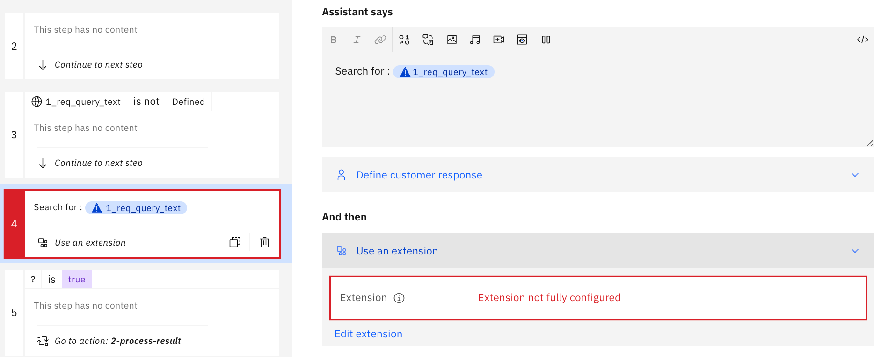

# The Setup of `Bring Your Own Search (BYOS)`

These are the main steps for the Setup of the `question and answering extension` with `Bring Your Own Search (BYOS)` for Watson Assistant. Press on each step to navigate to the details.

1. [Deploy a `Question Answering Service instance`](#1-deploy-a-question-answering-service-instance)
2. [`Watson Assistant Service`](#2-watson-assistant-service)
3. [Setup an extension for the `Question Answering Service instance`](#3-setup-an-extension-for-the-question-answering-service-instance)
4. [Configure your `assistant` to use the extension](#4-configure-your-assistant-to-use-the-extension)
5. [Test the `assistant`](#5-test-the-assistant)

Here is a short reminder of the dependencies of `Watson Assistant` you should be aware of:

You can create from a `Watson Assistant Service` in the `IBM Cloud catalog` a `Watson Assistant Service Instance` based on a pricing plan; this service instance can contain several Assistants. Each Assistant will include its configuration. 
([IBM Cloud documentation](https://cloud.ibm.com/docs/watson-assistant?topic=watson-assistant-welcome-new-assistant))

We will configure one `assistant` to access a custom search using an extension. This extension will access a `Question Answering Service instance` deployed on the cloud. (for example, IBM Cloud Code Engine)

The result will look like this:


The first entry is the `answer`; below, you see the resources the AI has used to create the answer.

---

### 1. Deploy a `Question Answering Service instance`

1. Deploy an instance of the `Question Answering Service`, for example, to `IBM Cloud Code Engine`
2. Insert your public server `https://URL` to access the `Question Answering Service` in the [`OpenAPI.json` file](/data/openapi.json) by changing the `servers` values to your needs.

```json
  "servers": [
    {
      "url": "https://YOUR_URL",
      "description": "YOUR_DESCIPTION"
    }
  ],
```

A server URL doesn't contain any endpoint invocation.

```json
  "servers": [
    {
      "url": "https://api-server.xyz122345.us-east.codeengine.appdomain.cloud",
      "description": "My API server on Code Engine"
    }
  ],
```

---

### 2. Watson Assistant Service

1. Create a [`Watson Assistant Service instance`](https://cloud.ibm.com/catalog/services/watson-assistant)
2. [Create a new `assistant`](https://cloud.ibm.com/docs/assistant?topic=assistant-assistant-add)

> Note: You should create a new `assistant` because we will replace your current `actions` configuration later!

---

### 3. Setup an extension for the **Question Answering Service instance**

#### 3.1 Create an extension

1. Select your `Assistant` of your `Watson Assistant service.`
2. Open `Integration` from the side menu
3. Navigate to the `Extensions` section
4. Press `Build custom extension`
5. Follow the steps in the wizard
    
    * Get started
    * Basic information

        * `Title`: Question and answering extension
        * `Description`: This is the extension to integrate the question and answering microservice via a REST API.

    * Import OpenAPI

        * Import your modified [`OpenAPI.json` file](/data/openapi.json)

    * Review the extension

#### 3.2 Deploy the extension to an `assistant` environment

An `assistant` has two minimal environments: `Draft` and  `Live`.
We will add the extension to the `Draft` environment.

1. Open `Integration` from the side menu
2. Navigate to the `Extensions` section
3. Press `Add` on your created extension in the integration catalog
4. Select `Draft` and press `Confirm`

---

### 4. Configure your `assistant` to use the extension

Now we will import an existing configuration for the `assistant` actions to use the `question and answering extension`, and then we will configure the actions and variables to use the extension.

#### 4.1 Import an existing configuration for the actions

1. Open `Actions` from the side menu
2. Select `Global settings` in the upper right corner
3. Select the tab `Upload/Download`
4. Upload the action JSON file called [demo-question-and-answering-action-configuration.json](./configuration/demo-question-and-answering-action-configuration.json) and press `Save`.

> Note: **This will replace the current configuration of your existing assistant.**

#### 4.2 Verify the newly created actions

The following table contains an overview of the created actions and their responsibilities. The numbering represents the order and the execution of the actions.

| Action | Responsibility |
| --- | --- |
| `1-search` | This action handles the user's search entry and will start the search with the extension. The return values of the search will be saved in variables when a search is successful. Then the action `2-process-result` will be invoked. |
| `2-process-result` | This action gives you additional verification possibilities for the search result return values. Then the action `3-select-search-result-to-show` will be invoked. |
| `3-select-search-result-to-show` | This action selects one of the search's return values to be displayed later. The configuration of this action defines the number of return values you will display later. Then the action `4-display-search-result` will be invoked. |
| `4-display-search-result` | This action is responsible for the search results entries. Here you can define how the result entry will be displayed and add conditions before it is displayed. |

### 4.3 Configure the `1-search` action

Now we need to configure the use of the extension of our `extension`.

1. You will see that Step 4 is marked red.



2. Select `Edit extension` 

    1. Configure `Extension` to use the `Question and answering extension`.
    2. Configure `Operations` to use one of the available operations.
    3. Example for a configuration:
    
    _Note:_ If you don't see the same result as in the image above, select for the parameter value `query` the option `Expression` in the `Set to` field and insert `"text:".concat(${1_req_query_text})` in the text field.

    4. Press `Apply`

### 5. Test the `assistant`

1. Open `Preview` from the side menu
2. Enter demo search: `When and for how much did IBM acquire Red Hat?`
    
    

    The first entry is the `answer`; below, you see the resources the AI has used to create the answer.